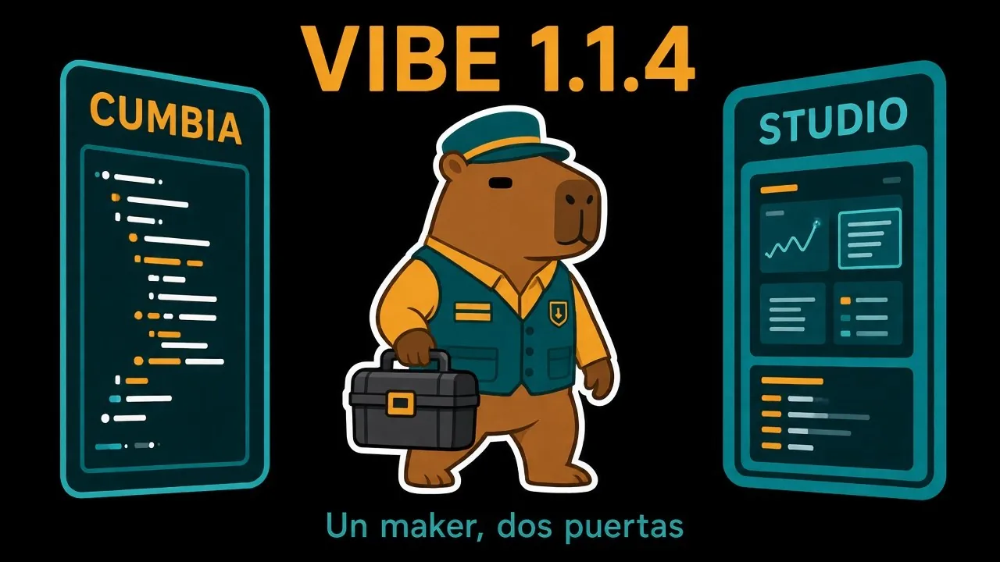
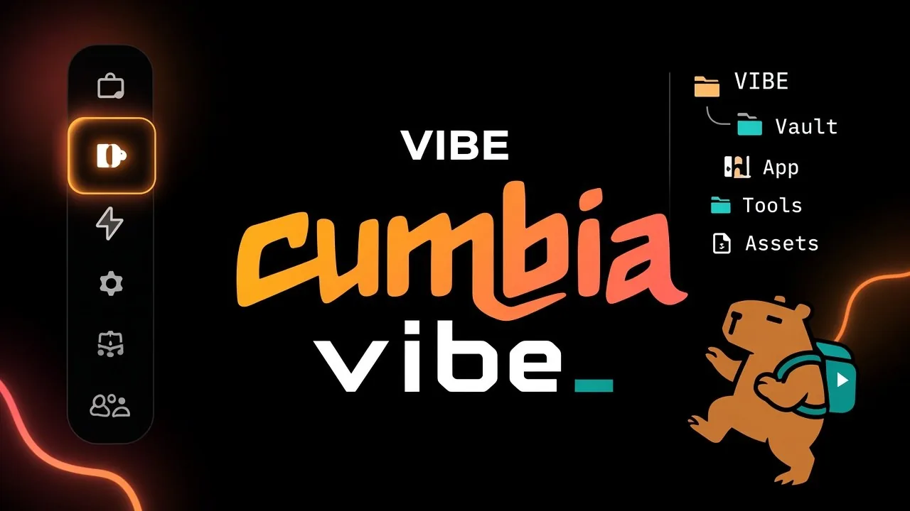
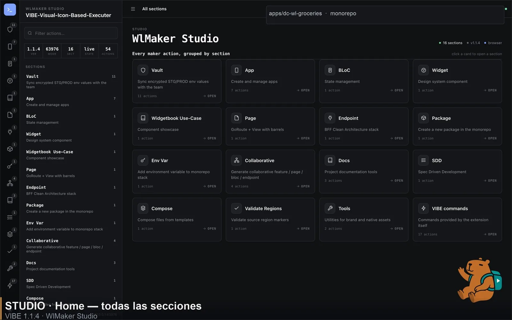
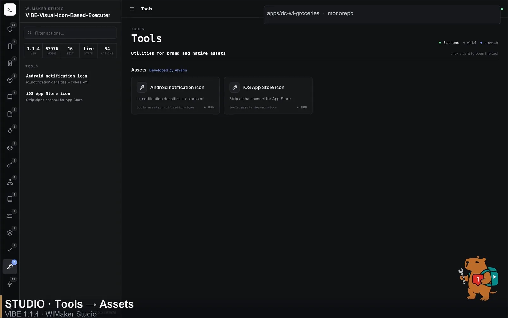
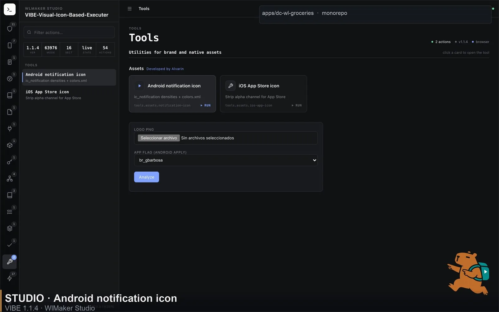
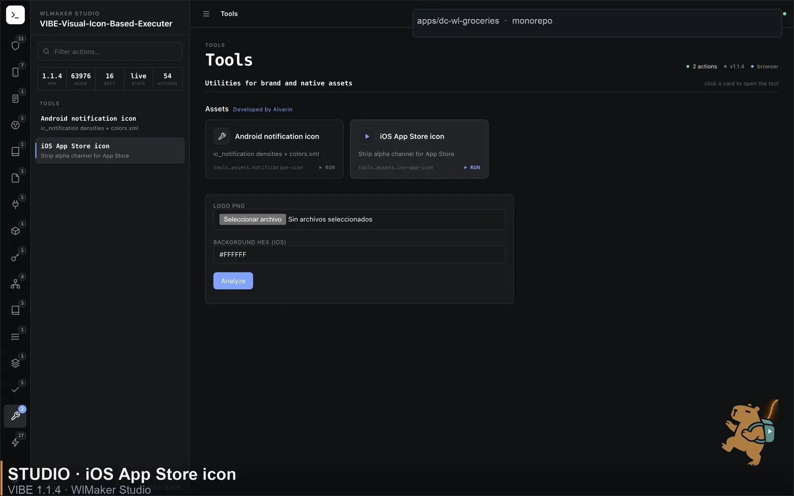
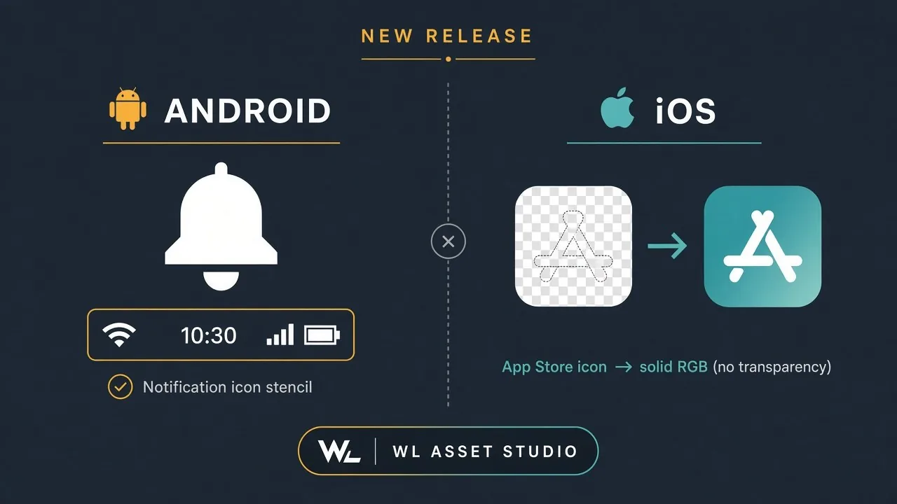
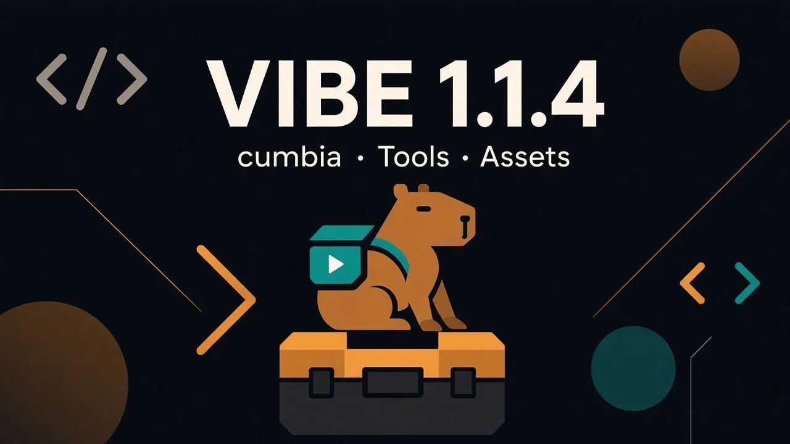
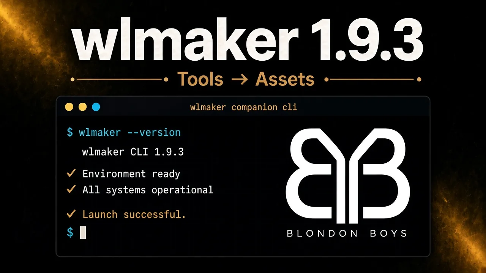

# 🚀 Lanzamiento oficial — VIBE 1.1.4 + wlmaker 1.9.3



El equipo de **Blondon Boys** anuncia el lanzamiento dual de **VIBE v1.1.4** y **wlmaker-cli v1.9.3**.

No es “otro vsix”. Es el maker completo en la barra de actividad, con dos puertas principales:

1. **cumbia** — el menú del CLI, dentro de VS Code  
2. **Studio** — el visualizador web (webview + navegador)  

Además: **Tools → Assets** (desarrollado por **Alvarin**) y una **nueva distribución pública** para instalar sin invitación a GitHub.

---

## 🕺 VIBE · cumbia



**cumbia** es la vista de WlMaker dentro de VIBE. La misma estructura del CLI, en la barra lateral:

• Abre la barra de actividad de **VIBE** → pestaña **cumbia**  
• Ahí está el catálogo completo del maker (igual que `wlmaker` en la terminal)  
• Clic → asistente → archivos en el monorepo  

### Qué incluye cumbia hoy

• **Vault** — sincronización cifrada de STG/PROD con el equipo  
• **App** — nueva app, splash, firebase, bundle id, entitlements…  
• **BLoC / Widget / Use-Case / Page / Endpoint / Package / Env Var**  
• **Collaborative** — feature / page / bloc / endpoint  
• **Docs** — serve, commands, architecture  
• **SDD** — ticket, package spec, visualizador  
• **Compose / Validate Regions**  
• **Tools → Assets** ⬅ **nuevo**, por **Alvarin**

> Si ya usabas el CLI, ya sabes usar **cumbia**. Misma jerarquía. Misma lógica. Sin salir del IDE.

---

## 🎛️ VIBE · Studio



**Studio** es la otra forma de usar el maker: una pantalla grande con todas las secciones y botones a la vista (capturas reales abajo).

• **Home** — cuadrícula de todas las secciones (icono, descripción, cantidad de acciones)  
• **Rail** — selector de secciones (Vault, App, SDD, Tools, comandos VIBE…)  
• **Tarjetas** — cada acción es un botón para ejecutar  
• **Dónde se abre:**
  * Dentro de VS Code (`Open Studio`)
  * En el navegador de tu máquina (`Open Studio in Browser`)



### Cómo abrirlo

1. Vista **cumbia** → botón de Studio / paleta de comandos  
2. O: `WlMaker: Open Studio` / `Open Studio in Browser`  

En **Tools**, al hacer clic en una tarjeta de Assets aparece el panel Analyze:





---

## ✨ Novedad destacada — Tools → Assets (Alvarin)



Integramos el **WL Asset Studio** al maker. Misma lógica de píxeles. Sin Flutter embebido. TypeScript puro.

### Icono de notificación Android

• Analiza el logo de marca  
• Máscara alpha (blanco ∪ tercer color bajo el corte)  
• Genera `ic_notification.png` en mdpi→xxxhdpi + `drawable/`  
• Fusiona `notification_color` en `colors.xml`  
• Aplica en `apps/<flag>/android/app/src/main/res/`  

**Por qué importa:** sin esto, FCM usa el launcher y Android muestra una mancha blanca en la barra de estado.

### Icono de App Store (iOS)

• Elimina el canal alpha → PNG de 3 canales  
• Veredicto: limpio / alpha sin usar / transparencia real  
• Fondo configurable cuando hay que aplanar  

**Por qué importa:** App Store Connect → **ITMS-90717**.

### Dónde está disponible

| Superficie | Ruta |
| --- | --- |
| **cumbia** | Tools → Assets → tarjeta |
| **Studio** | Rail Tools → clic en tarjeta → Analyze |
| **wlmaker CLI** | Tools → Assets |

Crédito en la interfaz: **Developed by Alvarin**.

---

## 📦 Cómo se distribuye VIBE ahora (leer completo)



El código fuente sigue siendo privado. El equipo **no necesita** invitación.

Los builds se publican en un repositorio público de assets: **`MatiasZL/vibe-dist`**.

### Enlace permanente

```text
https://github.com/MatiasZL/vibe-dist/releases/latest/download/vibe.vsix
```

### macOS / Linux (recomendado)

1. Descarga [`install-vibe.command`](https://github.com/MatiasZL/vibe-dist/releases/latest/download/install-vibe.command)  
2. Doble clic, o:

```bash
chmod +x install-vibe.command
./install-vibe.command
```

3. Recarga VS Code (`Cmd+R` / Reload Window)

### Instalación manual

```bash
curl -fL -o vibe.vsix \
  https://github.com/MatiasZL/vibe-dist/releases/latest/download/vibe.vsix
code --install-extension ./vibe.vsix --force
```

Después: barra de actividad **VIBE** → **cumbia**. Abre **Studio** cuando quieras el visualizador.

---

## 🧰 Contenido completo de VIBE 1.1.4

Además de cumbia + Studio:

• **Configurations** — launcher de debug con iconos  
• **Devices** — emuladores / dispositivos  
• **Vibe Compare** — árbol de cambios / PRs  
• **Vibe Tree** — exploración del workspace  
• **cumbia** — maker completo (ver arriba)  
• **Studio** — centro de comando web (ver arriba)  

Una barra de actividad. El flujo diario del monorepo.

---

## 🖥️ wlmaker-cli v1.9.3



Paridad con VIBE: el menú interactivo ahora también incluye **Tools → Assets**.

```bash
npm i -g wlmaker@latest
wlmaker
# → Tools → Assets → Android | iOS
```

---

## 🛠️ Mejoras de esta versión

• Studio Assets: panel **bajo demanda** (aparece al hacer clic en la tarjeta)  
• **App flag** solo en Android · **Background hex** solo en iOS  
• Dominio de assets en TypeScript, con pruebas de máscara / densidades / strip alpha  
• Release de VIBE → `vibe-dist` público, instaladores con `curl` (sin `gh auth`)

---

**Un maker. Dos puertas. cumbia + Studio.**  
Assets de marca sin salir del flujo. Distribución sin invitación.

Saludos,  
**BlondonBoys**
